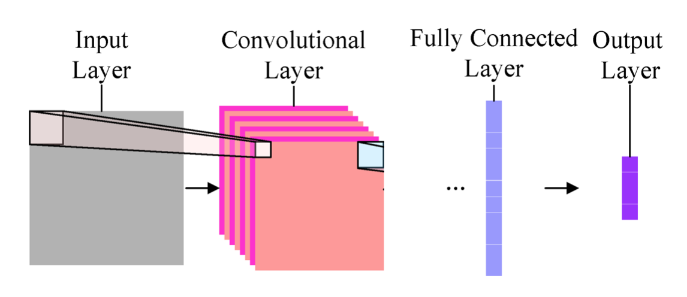

# Day-and-Night Image Classifier

## Introduction

This project is focusing on building an image classifier that can accurately label images as either day or night by
identifying key distinguishing features in the images.

## Neural Networks Overview

Neural networks are algorithms that learn to recognize patterns in data and group them accordingly. They function
similarly to how you might separate seashells by color and shape. **Deep neural networks (DNNs)** take this further by
layering multiple classifiers to separate more complex data patterns.

## Convolutional Neural Networks (CNNs)

**Convolutional Neural Networks (CNNs)** are a type of deep neural network especially powerful in image processing. They
consist of layers designed to process visual information. Key layers include:

### Convolutional Layer

- Inputs an image array.
- Acts like a set of filters to extract features such as edges.
- Outputs **feature maps**, which are filtered versions of the original image.

## Day-and-Night Classification from Scratch

In this project, you'll extract color and shape features from images and classify them. This hands-on experience mirrors
how CNNs operate, identifying patterns in training images, adjusting filters, and learning from errors.

## Further Learning

CNNs often include additional layers to standardize or reduce data dimensionality, making networks more efficient. If
you're interested in deeper learning, check out
this [article on CNNs](https://ujjwalkarn.me/2016/08/11/intuitive-explanation-convnets/).

## Evaluation Metrics

### Accuracy

Accuracy is determined by comparing the predicted label to the true label. It’s calculated by dividing the number of
correct predictions by the total number of images in the test set.

### Test Data

Test data refers to new, unseen data used to evaluate the model’s performance. Training data is used to build the model,
while test data helps validate how well the model generalizes to real-world scenarios.

### Misclassified Images

Analyzing misclassified images can provide insights for improving the model. By reviewing the incorrect predictions, you
can fine-tune the classifier to reduce errors.

## Complete Image Classification Pipeline

This project takes you through all steps required to build an image classifier, from pre-processing and feature
extraction to implementing the classifier and evaluating its performance.

## Technology Stack

- **Python**
- **Object-Oriented Design**
- **Jupyter Notebook**
- **Data Visualization**
- **Machine Learning & AI**
- **Localization & Prediction**
- **Data Structures**
- **OpenCV**